<p align="center">
  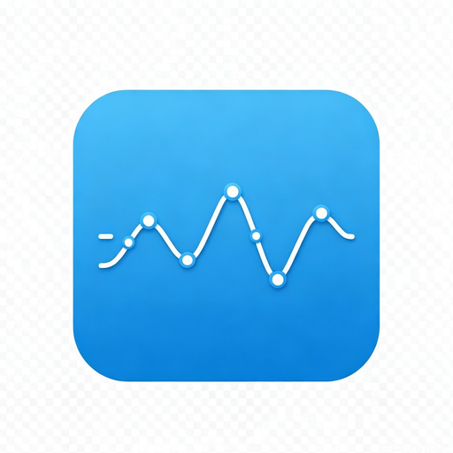
</p>

<h1 align="center">SSE DevTools Panel</h1>

<p align="center">
  <em>SSE / EventSource / NDJSON debugger for Chrome DevTools</em>
</p>

<p align="center"><a href="./README.zh-CN.md">中文</a></p>

<p align="center">
  <strong>A Chrome extension to debug SSE / EventSource / NDJSON streams in DevTools.</strong><br/>
  After install, open F12 → SSE DevTools to inspect events, conversation, timeline, and global search.<br/>
  Built for long-lived streams such as AI chats, notifications, and progress updates.
</p>

<p align="center">
  <a href="https://github.com/FatMii/sse-devtools-panel/actions/workflows/ci.yml"></a>
  &nbsp;
  <a href="./LICENSE"></a>
  &nbsp;
  <a href="#"></a>
  &nbsp;
  <a href="#"></a>
</p>

---

<p align="center">
  <!-- SCREENSHOT: hero / panel overview -->
  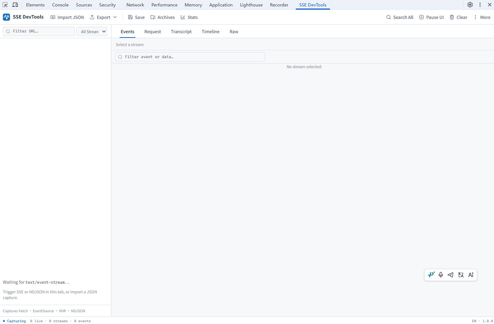
</p>

---

# Table of contents

- [Table of contents](#table-of-contents)
- [Why you need it](#why-you-need-it)
- [What it is / is not](#what-it-is--is-not)
- [Features](#features)
  - [🎣 Stream capture](#-stream-capture)
  - [📚 Streams sidebar](#-streams-sidebar)
  - [📋 Events](#-events)
  - [📨 Request](#-request)
  - [🧠 Conversation](#-conversation)
  - [⏱ Timeline](#-timeline)
  - [📄 Raw](#-raw)
  - [🛠 Analysis & toolbar](#-analysis--toolbar)
  - [💾 Import / export / archives](#-import--export--archives)
  - [🌐 i18n & settings](#-i18n--settings)
- [Screenshots](#screenshots)
  - [Main workbench](#main-workbench)
  - [Toolbar & More menu](#toolbar--more-menu)
  - [Demo page](#demo-page)
- [Supported AI web vendors](#supported-ai-web-vendors)
- [Quick start](#quick-start)
  - [Prerequisites](#prerequisites)
  - [Install & load](#install--load)
- [30-second demo](#30-second-demo)
- [Development](#development)
- [Limitations](#limitations)
- [Contributing](#contributing)
- [License](#license)

---

# Why you need it

Chrome Network already has an [EventStream](https://developer.chrome.com/docs/devtools/network/reference#analyze-events-in-a-stream) tab for **standard SSE** (alongside Headers / Response), so you can watch events arrive while the stream is open.

For many AI / product streams that is not enough. They are often not plain EventSource, and common pain points are:

- Most use **`fetch` + custom SSE / NDJSON / Connect+JSON**. Network often shows hard-to-read Response fragments, or an empty / useless EventStream tab
- **No in-stream timing** (TTFT, chunk gaps, stall distribution, reconnect markers)
- **AI chats are hard to read**: thinking / content / tool calls / search sources mixed in raw frames and need manual stitching

| Scenario                                         | Chrome Network                                       | SSE DevTools Panel                                |
| ------------------------------------------------ | ---------------------------------------------------- | ------------------------------------------------- |
| Standard SSE (EventSource / some fetch)          | EventStream tab on the request                       | Same view, plus filters, JSON tree, export        |
| AI / private protocols (NDJSON, Connect+JSON, …) | Mostly raw fragments; hard to reassemble into a chat | Profile detection + **Conversation** channels     |
| In-stream timing & stalls                        | Mostly whole-request duration                        | Timeline + Stats (TTFT / gap / events·s)          |
| Spec & anomalies                                 | No targeted scan                                     | SSE Spec warnings · Anomalies                     |
| Web search / tool results                        | Buried in raw                                        | Normalized `web_search` cards (queries + sources) |

---

# What it is / is not

**SSE DevTools Panel is**

- A dedicated Chromium **DevTools panel** (F12 → SSE DevTools)
- A stream debugging workbench: list · timing · request · conversation · export / replay

**SSE DevTools Panel is not**

- A replacement for the Network panel (full Headers audit still belongs in Network)
- A general packet sniffer / MITM proxy

---

# Features

## 🎣 Stream capture

- **Transports** — streams started with `fetch`, `EventSource`, or `XHR`
- **Formats** — SSE (`text/event-stream`), NDJSON, Connect+JSON
- **Independent view** — the panel can read stream content without changing page behavior
- **Lifecycle** — records abort, errors, close reasons, plus EventSource reconnects and `Last-Event-ID`
- **Fewer false positives** — a response appears in the sidebar only after it is confirmed as streaming content, so ordinary JSON / analytics requests are less likely to clutter the list

## 📚 Streams sidebar

- Live list of streams captured on the page: method, URL, status, event count
- Filter by URL search and transport (All / Fetch / EventSource / XHR)
- Shows matched vs total count after filtering
- Sidebar width is resizable

<p align="center">
  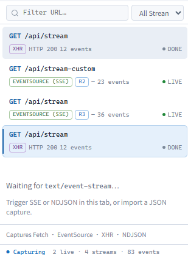
</p>

## 📋 Events

Inspect stream events row by row: index, arrival time, event name, data summary.

- Click a row to expand JSON (collapsible)
- Filter event / data with text or regex
- Column widths are resizable
- Jump to matching rows from Timeline / Raw

<p align="center">
  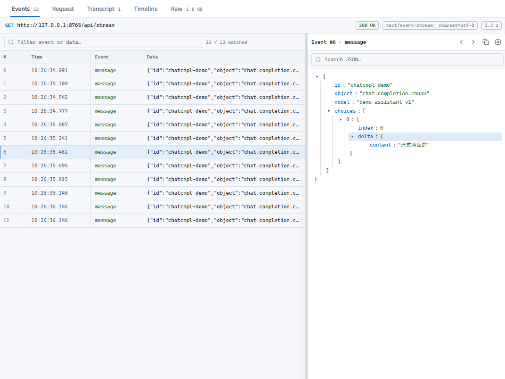
</p>

## 📨 Request

Inspect the request for the selected stream (similar to Network):

- Request headers and body
- Sensitive headers redacted automatically
- Shown together with method, URL, status, and other basics

<p align="center">
  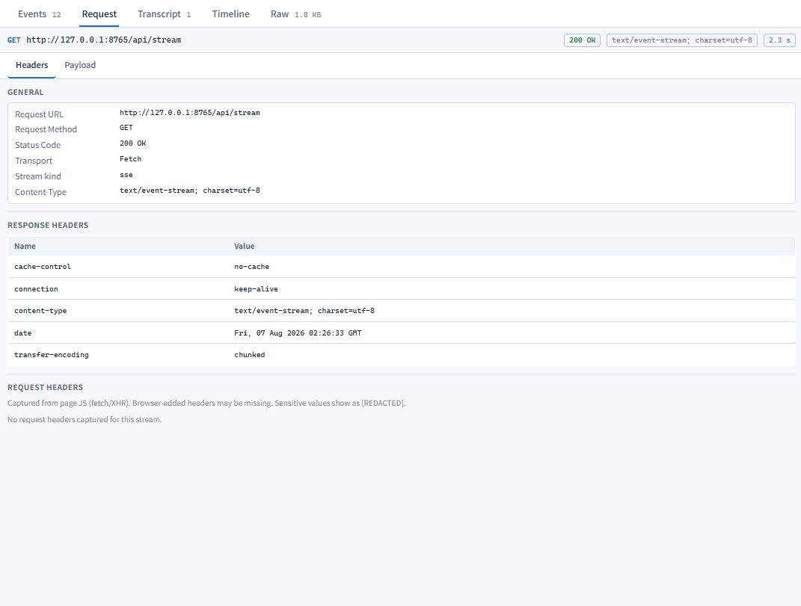
</p>

## 🧠 Conversation

Merge stream fragments into a readable conversation, split by channel:

| Channel      | What you see                                            |
| ------------ | ------------------------------------------------------- |
| **Content**  | Final answer                                            |
| **Thinking** | Thinking / deep-search process                          |
| **Tools**    | Function calls; web search becomes query + source cards |
| **Meta**     | Finish reason, usage, model, protocol type, and more    |

- Top chips show the detected protocol and site hint
- Tool cards are collapsible; web search shows query chips and result lists (title / URL / snippet)
- One-click copy for the current channel
- Most major Chinese AI web apps and OpenAI-compatible APIs can be merged (see the [support matrix](#supported-ai-web-vendors) below)

<p align="center">
  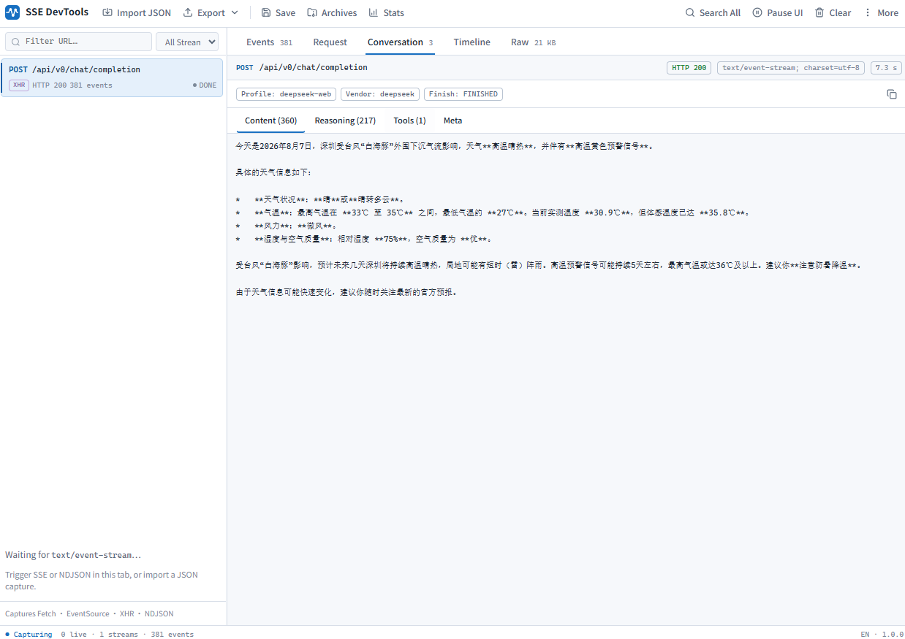
</p>

<p align="center">
  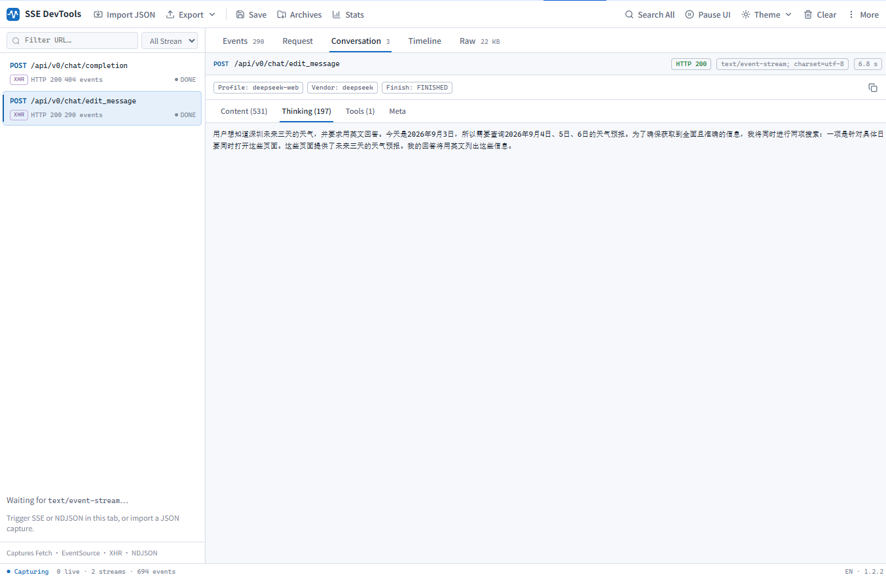
</p>

<p align="center">
  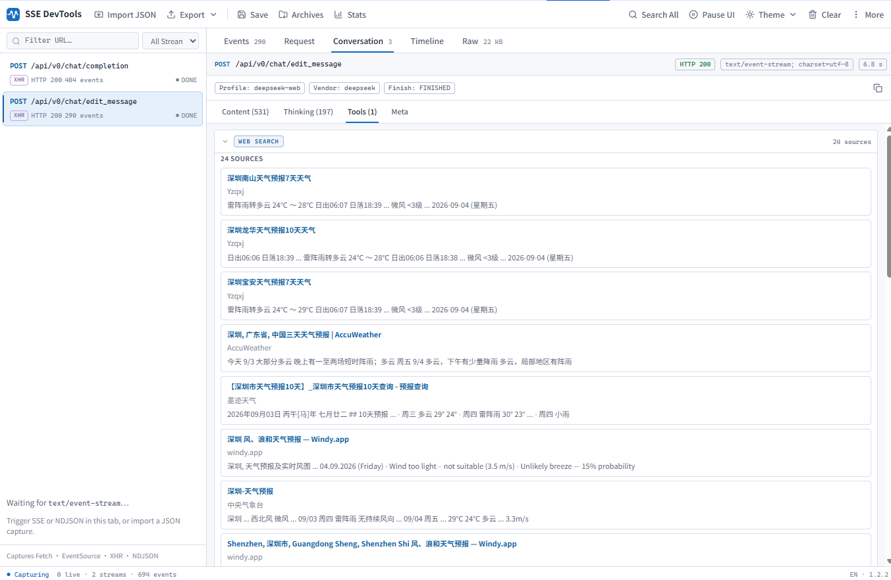
</p>

## ⏱ Timeline

Use the timeline to see when events arrived and how long gaps lasted:

- **Arrival track** — each event placed by arrival time; click to jump to the Events row
- **Stall highlight** — events with ≥250ms gap from the previous one are marked red
- **Gap distribution** — histogram of waits between adjacent events; long stalls stand out
- **Reconnect markers** — EventSource reconnects appear on the track, with reconnect count and Last-Event-ID

<p align="center">
  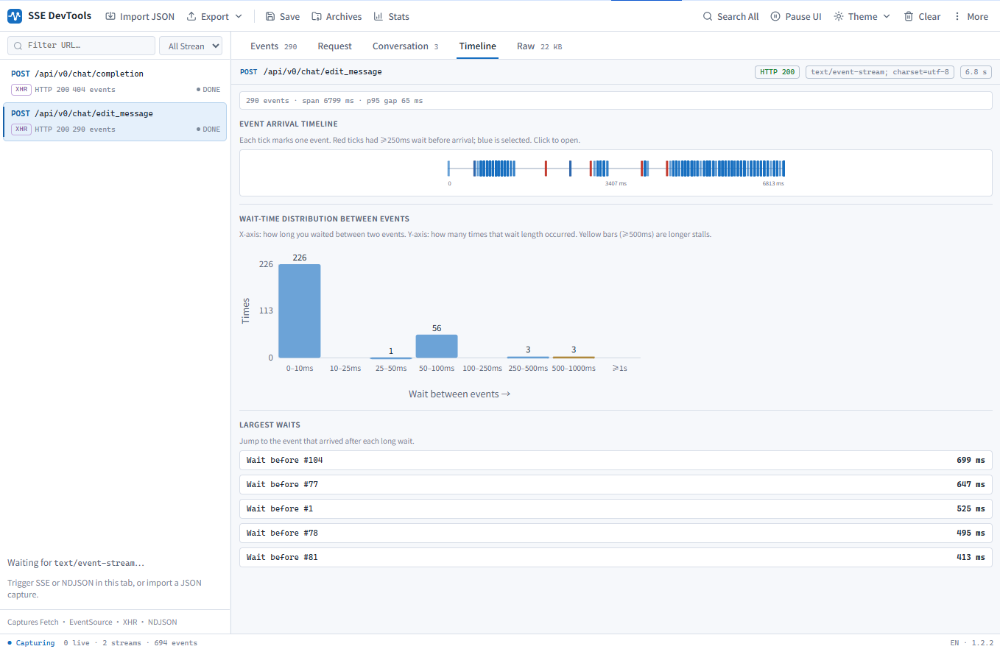
</p>

## 📄 Raw

View the stream text so you can compare it with Events / Conversation:

- Full text rebuilt from parsed events
- One-click copy

## 🛠 Analysis & toolbar

| Capability         | Description                                                                   |
| ------------------ | ----------------------------------------------------------------------------- |
| **Pause / Resume** | Pauses UI refresh only; capture keeps running; resume refreshes list & detail |
| **Stats**          | First-byte latency, duration, avg / max gap, events per second, and more      |
| **Anomalies**      | Scans empty data, odd gaps, and similar suspects                              |
| **Spec**           | SSE-spec hints for fields, newlines, BOM, and related issues                  |
| **Search All**     | Global search across streams                                                  |
| **Clear**          | Clears streams captured in the current session                                |
| **Settings**       | Opens the options page (language, etc.)                                       |

<p align="center">
  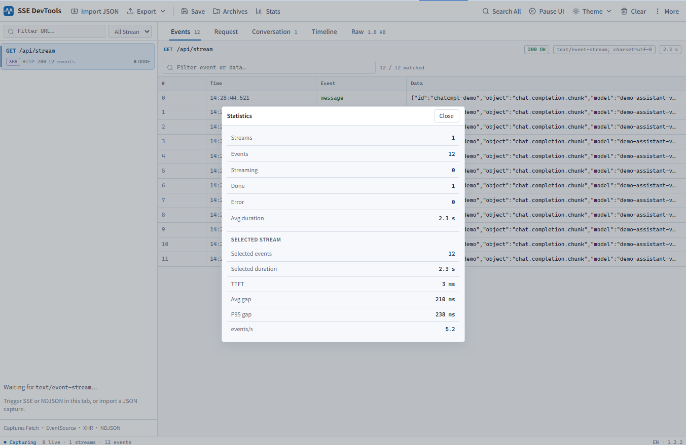
</p>

## 💾 Import / export / archives

- **Export** — JSON, CSV, or `.sse` text files
- **Import** — load a local JSON file and replay it in the panel
- **Save / Archives** — save the selected stream locally and open it again later

## 🌐 i18n & settings

- UI supports Chinese and English
- Options page: follow the browser language, or pin one language

---

# Screenshots

## Main workbench

Pick a stream in the sidebar; switch Events / Request / Conversation / Timeline / Raw on the right.

<p align="center">
  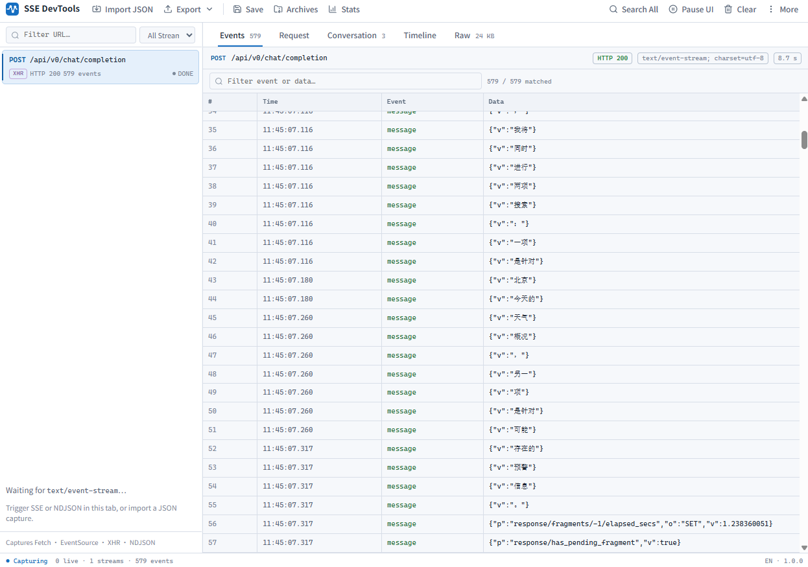
</p>

## Toolbar & More menu

Common actions live in the top bar: import, export, archives, Stats, pause, clear. Anomalies, Spec, global search, and settings are under **More**.

<p align="center">
  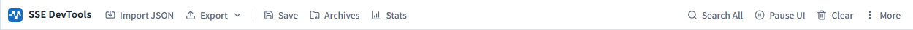
</p>

## Demo page

The local demo can start an SSE stream in one click, so you can confirm the extension is working.

<p align="center">
  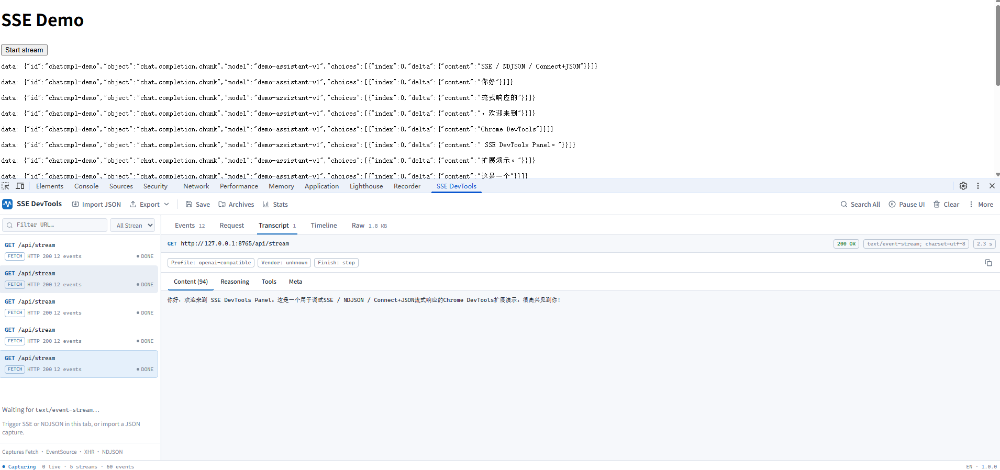
</p>

---

# Supported AI web vendors

Conversation merges content by protocol profile. Currently supported:

| Profile             | Typical site / shape    | Notes                                     |
| ------------------- | ----------------------- | ----------------------------------------- |
| `openai-compatible` | OpenAI-compatible APIs  | Content / thinking / tool calls           |
| `deepseek-web`      | DeepSeek web            | Thinking + content; search tools          |
| `doubao-web`        | Doubao web              | Split thinking / content; deduped sources |
| `kimi-web`          | Kimi                    | Thinking / content / search               |
| `qwen-web`          | Qwen web                | Plan thinking / deep thinking / search    |
| `chatglm-web`       | ChatGLM / Zhipu Qingyan | Thinking / content / search results       |
| `yuanbao-web`       | Tencent Yuanbao         | Deep-search thinking + sources            |
| `anthropic`         | Anthropic-style SSE     | Basic detection                           |
| `generic`           | Unrecognized            | Events / Timeline / Raw still work        |

> Vendor protocols change often. If Conversation is empty or tool cards look wrong, export Raw or JSON and include the URL.  
> Sites not listed here are adapted after we have a real sample.

---

# Quick start

### Prerequisites

- Node.js 20+ (recommended)
- [pnpm](https://pnpm.io) 10.x (see the `packageManager` field)
- A Chromium-based browser (Chrome / Edge / …)

### Install & load

```bash
git clone https://github.com/FatMii/sse-devtools-panel.git
cd sse-devtools-panel
pnpm i
pnpm build
```

1. Open `chrome://extensions` and enable **Developer mode**
2. **Load unpacked** → select the repo’s **`dist/`** folder
3. Open the target site → <kbd>F12</kbd> → **SSE DevTools**
4. **Refresh the page**, then trigger a streaming API (the extension must be active at page load)

While coding, use `pnpm dev` for watch builds, then click **Reload** on the extensions page.

More collaboration notes: [CONTRIBUTING.md](./CONTRIBUTING.md), [docs/GITHUB_SETUP.md](./docs/GITHUB_SETUP.md).

---

# 30-second demo

```bash
pnpm build && pnpm demo
```

1. Open <http://127.0.0.1:8765>
2. Confirm the extension is loaded → open DevTools → **SSE DevTools**
3. **Refresh the demo page** → click **Start stream**
4. A stream should appear in the sidebar; Events / Conversation / Timeline / Raw tabs should have data

---

# Development

```bash
pnpm build        # typecheck + bundle into dist/
pnpm dev          # watch build
pnpm typecheck
pnpm lint
pnpm format
pnpm test-only    # parsers / export / Spec / timing / conversation merge tests
```

| Path                         | Role                                                      |
| ---------------------------- | --------------------------------------------------------- |
| `src/content/inject/`        | Page-side capture: fetch / EventSource / XHR patches      |
| `src/content/inject-main.ts` | Inject entry (loads the patches above)                    |
| `src/content/bridge.ts`      | Forwards captured data into the extension                 |
| `src/background.ts`          | Extension background message relay                        |
| `src/devtools/`              | DevTools panel registration                               |
| `src/panel/`                 | Panel UI (`core` / `views` / `features` / `widgets`)      |
| `src/shared/`                | Shared parsers, timing, Spec, export, and related helpers |
| `src/shared/ai-merge/`       | Conversation merge (per-vendor profiles)                  |
| `src/options/`               | Options page                                              |
| `_locales/`                  | UI strings (`en` / `zh_CN`)                               |
| `demo/`                      | Local demo server                                         |
| `scripts/`                   | Build and test scripts                                    |

Before opening a PR, run:

```bash
pnpm format:check && pnpm lint && pnpm test-only && pnpm typecheck && pnpm build
```

---

# Limitations

- Chromium DevTools only (Chrome / Edge / …); no Firefox / Safari panel yet
- Requests started inside a page Service Worker are not captured
- Some deeper streaming API patterns may be missed; open an Issue with repro steps if you hit one
- Conversation depends on each site’s private protocol and may need updates after site changes
- For now, run `pnpm build` locally and load `dist/` from the extensions page

---

# Contributing

Issues and PRs are welcome. Please read [CONTRIBUTING.md](./CONTRIBUTING.md) first.

When reporting a bug, include repro steps, Chrome version, target URL, and whether the local demo reproduces it. For Conversation issues, attach Raw or exported JSON (redacted is fine).

For vendor adaptations, please include a real sample so we can match protocol changes.

---

# License

This project is released under the **[MIT](./LICENSE)** license.
