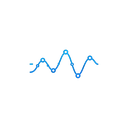

<p align="center">
  
</p>

<h1 align="center">EventStream Panel</h1>

<p align="center"><a href="./README.en.md">English</a></p>

<p align="center">
  <strong>Chrome ???? DevTools ?????? SSE / ?????</strong><br/>
  ????? F12 ? EventStream???????????? JSON????????
</p>

<p align="center">
  <a href="https://github.com/FatMii/eventstream-panel/actions/workflows/ci.yml"></a>
  &nbsp;
  <a href="./LICENSE"></a>
  &nbsp;
  <a href="#"></a>
  &nbsp;
  <a href="#"></a>
</p>

<p align="center">
  <code>v1.0.0</code> � ???
</p>

---

<p align="center">
  <!-- SCREENSHOT: hero / panel overview -->
  
</p>

> ?? **????** `docs/assets/screenshots/panel-overview.png`  
> ?????????? Streams ?? + ?? Detail???? Events / Transcript / Timeline ? Tab?

---

# ??

- [??????](#??????)
- [???? / ????](#????--????)
- [????](#????)
  - [????](#-????)
  - [Streams ??](#-streams-??)
  - [Events](#-events)
  - [Request](#-request)
  - [Transcript?AI ?????](#-transcriptai-????)
  - [Timeline](#-timeline)
  - [Raw](#-raw)
  - [??????](#-??????)
  - [?? / ?? / ??](#-??--??--??)
  - [??????](#-??????)
- [????](#????)
- [???? AI Web ??](#????-ai-web-??)
- [????](#????)
- [30 ? Demo](#30-?-demo)
- [??](#??)
- [?????](#?????)
- [??](#??)
- [????](#????)
- [????](#????)

---

<a name="??????"></a>

# ??????

Chrome Network ?**?? SSE**???????? [EventStream](https://developer.chrome.com/docs/devtools/network/reference#analyze-events-in-a-stream) Tab?? Headers / Response ???????????????

????? AI / ?????????????????? EventSource ???????

- ?? **`fetch` + ??? SSE / NDJSON / Connect+JSON**?Network ???????? Response ???? EventStream Tab ?? / ????
- **???????**?TTFT?chunk gap???????????
- **AI ????**??? / ?? / ???? / ????????????????

| ??                                          | Chrome Network             | EventStream Panel                         |
| --------------------------------------------- | -------------------------- | ----------------------------------------- |
| ?? SSE?EventSource / ?? fetch?          | ????? EventStream Tab | ??????????JSON ????         |
| AI / ?????NDJSON?Connect+JSON????? | ????????????? | Profile ?? + **Transcript** ?????  |
| ???????                                | ?????????         | Timeline + Stats?TTFT / gap / events톝? |
| ?????                                    | ??????               | SSE Spec ?? � Anomalies                 |
| ?????????                            | ?? raw ?                | ??? `web_search` ????? + ???   |

???**AI ???**??????????????? `text/event-stream` / NDJSON / Connect+JSON ????

---

<a name="????--????"></a>

# ???? / ????

**EventStream Panel ?**

- ??? Chromium **DevTools ??**?F12 ? EventStream?
- ???????`document_start`??????hook `fetch` / `EventSource` / `XHR`
- ???????????????? � ?? � ?? � AI Transcript � ????

**EventStream Panel ??**

- Network ???????Headers ?????? Network ???
- ?????? / MITM ??

---

<a name="????"></a>

# ????

<a name="????"></a>

## ?? ????

- **??** ? `fetch` � `EventSource` � `XHR`
- **??** ? SSE?`text/event-stream`?� NDJSON � Connect+JSON?? Kimi?
- **???** ? ?? `Response.clone()` ????????????? hook `getReader`??? JS ????
- **????** ? ?? `abort` / `error` / ???? � EventSource ?? � `Last-Event-ID`
- **?? announce** ? ???? `Content-Type` ?????????????? / ?? JSON ????

<a name="streams-??"></a>

## ?? Streams ??

- ?????????????????URL???????
- **URL ??** + **????**???All / Fetch / EventSource / XHR?
- ?????????????????? / ???
- **????**???? 180?640px?

<p align="center">
  
</p>

> ?? ???`docs/assets/screenshots/streams-sidebar.png`

<a name="events"></a>

## ?? Events

??????? � ???? � event ? � data ???

- ???? **??? JSON ?**
- **?? / ????**???????
- **????**
- ? Timeline / Raw ????????????

<p align="center">
  
</p>

> ?? ???`docs/assets/screenshots/tab-events.png`

<a name="request"></a>

## ?? Request

? Network ???????

- Headers / Payload
- ?????
- ??????method?URL?tags?????

<p align="center">
  
</p>

> ?? ???`docs/assets/screenshots/tab-request.png`

<a name="transcriptai-????"></a>

## ?? Transcript?AI ?????

???? SSE???????????????

| ??       | ??                                                     |
| ---------- | -------------------------------------------------------- |
| **??**   | ????                                                 |
| **??**   | reasoning / think / deepSearch ?                        |
| **??**   | ???????????? `web_search`??? + ????? |
| **???** | finishReason?usage?model?profile / vendor             |

- ?? **Profile ??**?? payload ?? + ?????
- ???????? � ??????? / URL / ???????
- ???? AI Web + OpenAI ??????????????[????](#????-ai-web-??)?

<p align="center">
  
</p>

> ?? ???`docs/assets/screenshots/tab-transcript-content.png`

<p align="center">
  
</p>

> ?? ???`docs/assets/screenshots/tab-transcript-tools.png`  
> ????????????????queries + ?????

<a name="timeline"></a>

## ? Timeline

- **????**??? event ????????
- **?????**?chunk gap ??
- **?250ms** ????????? Events ???
- **??**???????

<p align="center">
  
</p>

> ?? ???`docs/assets/screenshots/tab-timeline.png`

<a name="raw"></a>

## ?? Raw

- ??????????????
- **????**???? Issue / ? fixture

<a name="??????"></a>

## ?? ??????

| ??               | ??                                                               |
| ------------------ | ------------------------------------------------------------------ |
| **?? / ?? UI** | ??????**????**????? play ????????????? |
| **Stats**          | TTFT?????? / ?? gap?events톝 ?                           |
| **Anomalies**      | ?????? data??????????                              |
| **Spec**           | SSE ??????? / ?? / BOM ??                               |
| **Search All**     | ? Stream ????                                                 |
| **Clear**          | ????????                                                   |
| **Settings**       | ??????????                                               |

<p align="center">
  
</p>

> ?? ???`docs/assets/screenshots/dialog-stats.png`

<a name="??--??--??"></a>

## ?? ?? / ?? / ??

- **??** ? JSON?`eventstream-stream-v1`?� CSV � `.sse` Fixture??? Mock / ???
- **??** ? ???? JSON???????????
- **Save / Archives** ? IndexedDB ????????????

<a name="??????"></a>

## ?? ??????

- ?? **?? / English**
- ???????????????

---

<a name="????"></a>

# ????

## ???

?????? + ???????????????? Tab ?? Events / Request / Transcript / Timeline / Raw?

<p align="center">
  
</p>

> ?? ???`docs/assets/screenshots/main-workbench.png`

## ????????

?????????Stats??? UI?????????? Anomalies / Spec / ???? / ???

<p align="center">
  
</p>

> ?? ???`docs/assets/screenshots/toolbar.png`

## Demo ???

?? Demo ???? SSE??????????????

<p align="center">
  
</p>

> ?? ???`docs/assets/screenshots/demo-page.png`

---

<a name="????-ai-web-??"></a>

# ???? AI Web ??

Transcript ??? Profile ???????????? Web / ???????????????????

| Profile             | ???? / ??      | ??                                                 |
| ------------------- | -------------------- | ---------------------------------------------------- |
| `openai-compatible` | ?? OpenAI ?? API | `delta.content` / `reasoning_content` / `tool_calls` |
| `deepseek-web`      | DeepSeek ??        | JSON-patch ???? + ?????????             |
| `doubao-web`        | ????             | ??????????????                         |
| `kimi-web`          | Kimi?Connect+JSON? | think / text / search block                          |
| `qwen-web`          | ??????         | AgentProxy?`plan_cot` / `deep_think` / ?? bar     |
| `chatglm-web`       | ???? / ChatGLM   | `think` / `text` / `search` + `search_results`       |
| `yuanbao-web`       | ????             | `deepSearch` ???? + `searchGuid` ??            |
| `anthropic`         | Anthropic ?? SSE   | content_block ???????                         |
| `generic`           | ???               | ??? Events / Timeline / Raw                       |

> ?????????? Transcript ????????????? **Raw / JSON** ? Issue???? URL?  
> ??????????????????????

---

<a name="????"></a>

# ????

### ??

- Node.js 20+????
- [pnpm](https://pnpm.io) 10.x?? `packageManager` ???
- Chromium ??????Chrome / Edge ??

### ?????

```bash
git clone https://github.com/FatMii/eventstream-panel.git
cd eventstream-panel
pnpm i
pnpm build
```

1. ?? `chrome://extensions`??????????
2. ????????????? ?????? **`dist/`**
3. ?????? ? <kbd>F12</kbd> ? **EventStream**
4. **????**?????? `document_start`?????????

????? `pnpm dev` ????????????????????

?????????????? [CONTRIBUTING.md](./CONTRIBUTING.md)?[docs/GITHUB_SETUP.md](./docs/GITHUB_SETUP.md)?

---

<a name="30-?-demo"></a>

# 30 ? Demo

```bash
pnpm build && pnpm demo
```

1. ????? <http://127.0.0.1:8765>
2. ??????? ? ?? DevTools ? **EventStream**
3. **?? Demo ?** ? ?? **Start stream**
4. ???????Events / Timeline / Raw ???

---

<a name="??"></a>

# ??

```bash
pnpm build        # tsc --noEmit + ??? dist/
pnpm dev          # watch ??
pnpm typecheck
pnpm lint
pnpm format
pnpm test-only    # parser / connect / export / spec / timing / request-view / close / ai-merge
```

| ??                         | ??                                                          |
| ---------------------------- | ------------------------------------------------------------- |
| `src/content/inject-main.ts` | MAIN world??? fetch / EventSource / XHR                    |
| `src/content/` + `bridge`    | ISOLATED??????                                          |
| `src/background.ts`          | Service Worker ????                                       |
| `src/panel/`                 | DevTools ?? UI?`core` / `views` / `features` / `widgets`? |
| `src/shared/`                | ?? � ?? � Spec � ?? � AI Profile / Merge                |
| `src/options/`               | ???                                                        |
| `_locales/`                  | i18n?`en` / `zh_CN`?                                        |
| `demo/`                      | ?? SSE Demo ??                                            |

? PR ?????

```bash
pnpm format:check && pnpm lint && pnpm test-only && pnpm typecheck && pnpm build
```

---

<a name="?????"></a>

# ?????

```text
Page (MAIN)                    Extension                       DevTools
?????????????????????????      ?????????????????????           ??????????????
patch fetch / ES / XHR
        ?
   clone() + pump  ??postMessage??? bridge ??? SW ??? EventStream Panel
   (or observe getReader)               ?
        ?                               ?? ????? body ??????
        ?
   ?????? Response
```

---

<a name="??"></a>

# ??

- ??? **Chromium** DevTools??? Firefox / Safari ???
- ????? **Service Worker** ???? fetch
- ??? Stream API hook?`pipeThrough` / `pipeTo` ???????????????? Issue
- AI Transcript ???????????????????
- ???????? `pnpm build` ??? `dist/`

---

<a name="????"></a>

# ????

Issue / PR ??????? [CONTRIBUTING.md](./CONTRIBUTING.md)?

????????Chrome ????? URL?????? Demo ????? Transcript ??? **Raw ??? JSON**??????

???? Issue / Discussions ???????????????????????????????

---

<a name="????"></a>

# ????

????? **[MIT](./LICENSE)** ?????

---

<p align="center">
  <a href="https://github.com/FatMii/eventstream-panel">github.com/FatMii/eventstream-panel</a>
</p>
