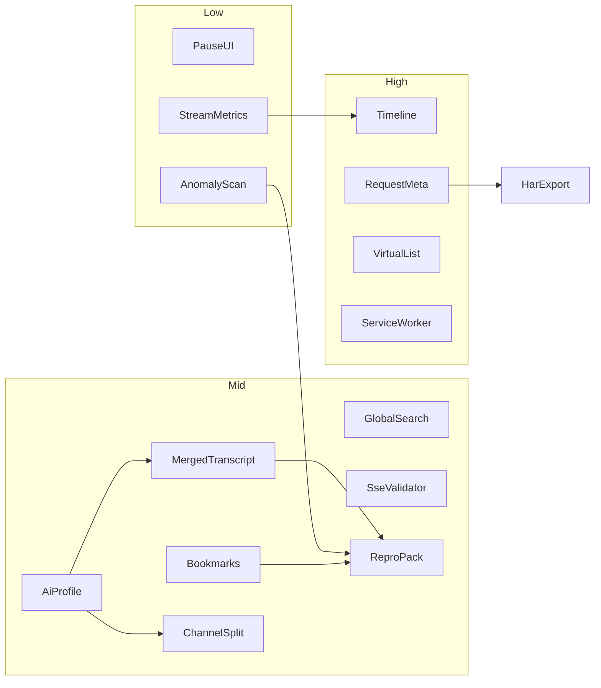

# B 组功能：难度排序与开发计划

## 难度排序（低 → 高）

难度综合：改动面、是否动 inject 捕获层、是否重写面板渲染、是否引入复杂可视化/多格式兼容。粗估：S 小 · M 中 · L 大 · XL 极大。

| 序 | 功能 | 难度 | 主要落点 | 为何是这个难度 |
|---:|------|:----:|----------|----------------|
| 1 | 暂停 UI / 不停捕获 | S | [`panel.ts`](D:/workspace/github/sse-devtools/src/panel/panel.ts) | 增加 `uiPaused` 标志，跳过 `scheduleRender*`，消息照收 |
| 2 | 流结束元数据（TTFT / 时长 / 均间隔 / events·s） | S | [`types.ts`](D:/workspace/github/sse-devtools/src/shared/types.ts) + Stats | `startedAt` / `receivedAt` / `endedAt` 已有，纯计算 |
| 3 | 异常扫描（空 data、JSON 失败、重复 id、超长包） | S–M | 新 `shared/anomaly.ts` + Dialog/角标 | 规则扫描现有 `events[]`，无捕获改动 |
| 4 | 跨 Stream 全局搜索 | M | 面板 Toolbar/Dialog + [`text-filter.ts`](D:/workspace/github/sse-devtools/src/shared/text-filter.ts) | 复用正则，需跨列表结果导航 |
| 5 | 书签 / 标注 | M | `SseEvent` 扩展 + 导出/存档 | 状态进 export/IndexedDB，UI 中等 |
| 6 | Merged Transcript（按厂商适配） | M–L | 新 `shared/ai-profile.ts` + `shared/ai-merge.ts` + Detail Tab | **暂缓/已回退**：需按厂商协议适配，误判回退 `generic` |
| 7 | 可复现导出包 | M | [`stream-snapshot.ts`](D:/workspace/github/sse-devtools/src/shared/stream-snapshot.ts) | 扩展 v2：stats + anomalies + notes（transcript 待 Phase 2 后再加） |
| 8 | SSE Spec 校验器（基础） | M | [`sse-parser.ts`](D:/workspace/github/sse-devtools/src/shared/sse-parser.ts) | 解析时产出 warning；注释/缺空行/未知字段等 |
| 9 | 协议 Profile 识别 | M–L | 新 `shared/ai-profile.ts` | **暂缓/已回退**；与 Transcript 一并实现 |
| 10 | 通道拆分（content / reasoning / tools / meta） | M–L | Detail 多 Tab + profile 投影 | **暂缓/已回退**；依赖 9 |
| 11 | Chunk 间隔直方图 | M–L | Stats/新 Timing 区 + SVG/CSS | 数据易算，可视化与布局成本中等 |
| 12 | 导出 Mock / Fixture | M–L | 导出菜单 | 从 `raw`/events 生成可回放 SSE/NDJSON 文本 |
| 13 | Event Timeline / Waterfall | L | 新视图（canvas/SVG） | 交互、缩放、与行选中联动 |
| 14 | 双流 Diff | L | Dialog + diff 算法 | 选两条 archive/imported；文本/事件序列两种模式 |
| 15 | 请求侧关联（Headers / Body） | L | [`inject-main.ts`](D:/workspace/github/sse-devtools/src/content/inject-main.ts) + types | **要改捕获协议**；Body 截断/脱敏策略 |
| 16 | Last-Event-ID / 重连可视化 | L | EventSource hook 加深 | 需记录重连、`Last-Event-ID`、retry |
| 17 | 虚拟列表（万级 events） | L | Events 表渲染重写 | 与列宽拖拽、筛选、选中、抽屉联动成本高 |
| 18 | 更深 ReadableStream + Abort 原因 | L–XL | inject | 边界多、易影响页面行为，需充分回归 |
| 19 | HAR-friendly 导出 | L–XL | 导出 | **实质依赖 15**；字段映射与兼容成本高 |
| 20 | Service Worker 内 fetch 捕获 | XL | 扩展架构 | MV3/SW 世界隔离，可靠性差，宜最后 spike |
| 21 | Firefox / Edge 适配 + 商店打磨 | XL | 工程/产品 | 非核心能力，属分发与兼容 |

---

## 开发计划（按依赖与收益，不是纯难度序）

原则：
- 先做**不改 inject** 的面板/后处理，快速形成差异化叙事。
- AI 语义以 **OpenAI Compatible 优先**，其它厂商用同一 Profile 接口增量加。
- 捕获层加深单独成阶段，避免和 UI 大改并行失控。
- 导出格式演进：`sse-devtools-stream-v1` 保留可读；新能力进 **v2**（向后兼容 parse）。

### Phase 1 — 面板基础增强（约 1 周）

目标：调试大流量时更稳，统计从「个数」变成「时序」。

1. [x] **暂停 UI / 不停捕获**：Toolbar 开关；`stream-chunk` 仍写入 `streams`，不触发全量重绘。
2. [x] **流指标**：基于现有时间戳算 TTFT（首 event − startedAt）、duration、avg/p95 gap、events/s；写入 Stats Dialog，并缓存到 record 派生字段（可不入库）。
3. [x] **异常扫描**：空 data、`JSON.parse` 失败、重复 `id`、单包超长；Stream 列表小角标 + Dialog 列表，点击跳到 event。
4. [x] **跨 Stream 全局搜索**：复用 `compileTextFilter`；结果列表显示 stream + event index，点击选中并打开抽屉。

验收：高频流可暂停界面仍涨事件数；Stats 有 TTFT/间隔；异常与全局搜索可用。

### Phase 2 — AI 语义主战场（暂缓，约 2–3 周）★

> **状态：暂缓（2026-07-28 回退）。** Transcript 面板、AI Profile、通道拆分、finish/usage 相关半成品已全部从代码库移除；后续专项回做，勿与 Phase 3/4 并行硬塞。

目标：对标品类差异化——「看得懂 AI 流」。

1. [ ] **`ai-profile.ts`**：启发式识别 `openai-compatible` | `anthropic` | `deepseek` | `doubao` | `generic`。
2. [ ] **`ai-merge.ts` + Transcript Tab**：Detail 增加 `Transcript`；按 profile 拼接 content；Copy Transcript 放在面板内。
3. [ ] **通道拆分**：Transcript 区子 Tab：`Content` / `Reasoning` / `Tools` / `Meta`。
4. [ ] **结束元数据增强**：从末包提取 `finish_reason` / `usage`（按 profile），展示在 meta chips。

验收：典型 `/chat/completions` 流可还原完整回答；工具调用参数可拼出；未识别协议不崩溃。

#### TODO：Transcript 回做清单（回头再实现）

- [ ] 新建 `shared/ai-profile.ts` + `shared/ai-merge.ts`
- [ ] OpenAI Compatible：`choices[].delta.content` / `reasoning_content` / `tool_calls`
- [ ] Anthropic：`content_block_delta` / thinking / `input_json_delta` / `stop_reason`
- [ ] DeepSeek：`message` / `update_session` / JSON Patch（`APPEND`/`BATCH`）
- [ ] Doubao：OpenAI 网关 + 原生 `content_type`/`block_type`/`patch_value`
- [ ] Panel：Transcript Tab + 通道子 Tab + Copy（面板内）
- [ ] Meta chips：`finish_reason` / `usage`
- [ ] 导出可选字段：`aiProfile`、`transcript`、`transcriptChannels`、`endMeta`
- [ ] 用真实网页抓包精调首包与 patch 边界

> 备注：曾经短暂落地过上述能力，因厂商协议差异大、半成品体验不稳，于 2026-07-28 整包删除；回做时建议先用真实 OpenAI/Anthropic/DeepSeek/豆包抓包样本驱动，再写 UI。

### Phase 3 — 协议可信 + 可带走（约 1.5–2 周）

1. **SSE Spec 警告**：parser 产出 `warnings[]`（或并行 lint 原始 block）；事件行/抽屉显示。
2. **书签/标注**：事件右键 Add note；存 `notes: Record<index, string>`；进 archive/export。
3. **复现包 v2**：JSON 含 metrics、anomalies、notes（`aiProfile` / `transcript*` 待 Phase 2 回做后补充）。
4. **Mock Fixture 导出**：一键下载纯 `text/event-stream` 回放文件（由 events 重装 wire 格式）。

验收：导出包可离线复现「看到了什么」；fixture 可被简单静态服务器重放。

### Phase 4 — 时序可视化（约 1.5–2 周）

1. **Chunk 间隔直方图**（先做）：Stats 内 SVG 柱状图即可。
2. **Timeline Waterfall**（后做）：横轴时间，点击联动 Events 行与抽屉。

验收：卡顿间隔一眼可见；Timeline 与表格选中同步。

### Phase 5 — 捕获层加深（约 2–3 周）

1. **请求关联**：`StreamStartPayload` 增加可选 `requestHeaders` / `requestBodyPreview`（长度上限 + 敏感头脱敏）；面板 Meta/侧栏只读展示。
2. **Abort / 断开原因**：fetch/XHR abort、error 分类写入 `errorMessage` 或新字段。
3. **Last-Event-ID / 重连**：加强 EventSource hook，记录 reconnect 次数与 id 序列；列表/Timeline 标注。
4. **更深 stream hook**：仅针对已确认漏抓场景补丁，不做无目标全量 hook。

验收：能看到请求头/体摘要；EventSource 重连可观察；已知漏抓 case 回归通过。

### Phase 6 — 规模与对比（约 2 周）

1. **虚拟列表**：Events 表虚拟化，保留列宽拖拽、筛选、选中、右键。
2. **双流 Diff**：从 Archives/当前列表选 A/B；先做 Transcript 文本 diff，再做 event 序列 diff。

验收：1 万+ events 可滚动操作；两条存档可对比回答差异。

### Phase 7 — 生态（有余力再做）

1. HAR-friendly（在 Phase 5 请求元数据齐全后）。
2. Service Worker 捕获：先做可行性 spike，再决定是否正式做。
3. Firefox/Edge + 商店素材/审核：产品向，不阻塞核心能力。

---

## 关键文件（按阶段）

| 阶段 | 主要文件 |
|------|----------|
| 1 | [`panel.ts`](D:/workspace/github/sse-devtools/src/panel/panel.ts) / [`panel.html`](D:/workspace/github/sse-devtools/src/panel/panel.html) / i18n |
| 2 | 新建 `shared/ai-profile.ts`、`shared/ai-merge.ts`；panel Transcript tab；tests（**暂缓/已回退**） |
| 3 | [`sse-parser.ts`](D:/workspace/github/sse-devtools/src/shared/sse-parser.ts)、[`stream-snapshot.ts`](D:/workspace/github/sse-devtools/src/shared/stream-snapshot.ts)、archive types |
| 4 | panel 新 Timing/Timeline 视图 + CSS |
| 5 | [`inject-main.ts`](D:/workspace/github/sse-devtools/src/content/inject-main.ts)、[`types.ts`](D:/workspace/github/sse-devtools/src/shared/types.ts)、bridge 透传 |
| 6 | Events 表渲染大改；diff 模块 |
| 7 | 导出/打包/文档 |

---

## 明确不做或压后（本计划内）

- 不并行启动 SW 捕获与虚拟列表（风险叠加）。
- 不在 Phase 2 追求「支持天下所有国内模型 UI」；用 Profile 插件式扩展。
- 不对真实上游做「一键重放请求」（鉴权/副作用）；只做 **本地 fixture 回放文件**。

---

## 建议立即开工的第一刀

**Phase 1 已完成。Phase 2 Transcript 整包暂缓（2026-07-28 已从代码库回退）→ 下一步建议 Phase 3（协议校验 + 导出增强）或 Phase 4（时序可视化）。Transcript 回做见上方 TODO 清单。**
