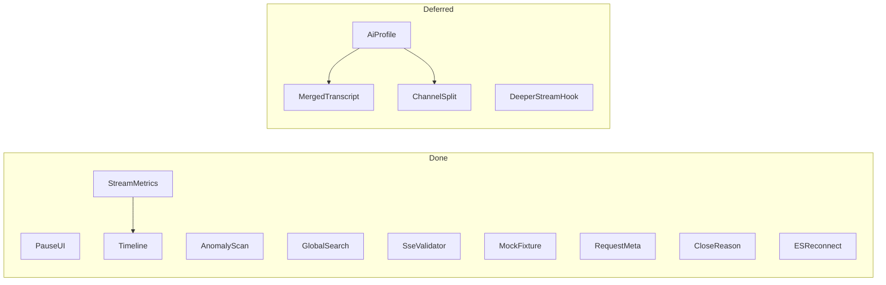

# B 组功能：难度排序与开发计划

## 当前状态总览（2026-07-28 对照代码）

| 阶段 | 状态 | 说明 |
|------|:----:|------|
| Phase 1 面板基础 | **已完成** | Pause UI、流指标、异常扫描、全局搜索 |
| Phase 2 AI / Transcript | **暂缓** | 代码无 `ai-profile` / Transcript Tab；整包回退待回做 |
| Phase 3 Spec + Fixture | **已完成** | Spec 警告 + `.sse` Fixture 导出 |
| Phase 4 时序可视化 | **已完成** | Timeline Tab：直方图 + 瀑布 + 大间隔跳转 |
| Phase 5 捕获加深 | **主体完成** | Request / closeReason / 重连已做；更深 stream hook **暂挂** |
| 原 Phase 6 生态等 | **不做** | 虚拟列表、双流 Diff、HAR、SW、多浏览器商店 — 已删阶段 |

**面板 Detail Tabs（现状）：** Events · Timeline · Request · Raw（无 Transcript）。

**已有导出：** `sse-devtools-stream-v1` JSON · CSV · Fixture `.sse`（无 HAR）。

---

## 难度排序（低 → 高）

难度综合：改动面、是否动 inject、是否重写面板渲染、多格式兼容。粗估：S 小 · M 中 · L 大 · XL 极大。

| 序 | 功能 | 难度 | 状态 | 主要落点 |
|---:|------|:----:|:----:|----------|
| 1 | 暂停 UI / 不停捕获 | S | **已完成** | [`panel.ts`](D:/workspace/github/sse-devtools/src/panel/panel.ts) `uiPaused` |
| 2 | 流指标（TTFT / 时长 / gap / events·s） | S | **已完成** | `StreamMetrics` + Stats Dialog |
| 3 | 异常扫描 | S–M | **已完成** | `panel.ts` 内联 `scanStreamAnomalies`（非独立 `anomaly.ts`） |
| 4 | 跨 Stream 全局搜索 | M | **已完成** | Search All Dialog + [`text-filter.ts`](D:/workspace/github/sse-devtools/src/shared/text-filter.ts) |
| 5 | Merged Transcript | M–L | **暂缓** | 待回做 `ai-profile` / `ai-merge` |
| 6 | SSE Spec 校验器 | M | **已完成** | [`sse-spec.ts`](D:/workspace/github/sse-devtools/src/shared/sse-spec.ts) |
| 7 | 协议 Profile 识别 | M–L | **暂缓** | 与 Transcript 一并 |
| 8 | 通道拆分 | M–L | **暂缓** | 与 Transcript 一并 |
| 9 | Chunk 间隔直方图 | M–L | **已完成** | Timeline 内 SVG（不在 Stats Dialog） |
| 10 | Mock / Fixture 导出 | M–L | **已完成** | `buildSseFixture` → `.sse` |
| 11 | Event Timeline / Waterfall | L | **已完成** | Timeline Tab |
| 12 | 请求侧关联（Headers / Body） | L | **已完成** | inject + Request Tab + [`request-view.ts`](D:/workspace/github/sse-devtools/src/shared/request-view.ts) |
| 13 | Last-Event-ID / 重连 | L | **已完成** | EventSource hook + `stream-reconnect` |
| 14a | Abort / closeReason | L | **已完成** | [`stream-close.ts`](D:/workspace/github/sse-devtools/src/shared/stream-close.ts) + inject |
| 14b | 更深 ReadableStream hook | L–XL | **暂挂** | 等确认漏抓 case；当前仅 clone + 可选 getReader 观察 |
| 15 | HAR-friendly 导出 | L–XL | **不做** | — |
| 16 | Service Worker 内 fetch | XL | **不做** | — |
| 17 | Firefox / Edge + 商店 | XL | **不做** | — |
| — | 虚拟列表 / 双流 Diff | L | **不做** | 原规模阶段已删 |

---

## 开发计划（按依赖与收益）

原则：
- 先做**不改 inject** 的面板/后处理，再加深捕获层。
- AI 语义以 **OpenAI Compatible 优先**；回做时用真实抓包驱动。
- 导出：保持 JSON v1 / CSV / `.sse` fixture；不做复现包 v2、不做 HAR（现阶段）。

### Phase 1 — 面板基础增强 ✅

1. [x] **暂停 UI / 不停捕获**：Toolbar；chunk 仍写入，跳过全量重绘。
2. [x] **流指标**：TTFT、duration、avg/p95 gap、events/s → Stats Dialog + `record.metrics`。
3. [x] **异常扫描**：空 data、`JSON.parse` 失败、重复 `id`、超长包（≥16KB）；列表 `!N` + Dialog 跳转。实现位于 `panel.ts`（未拆 `shared/anomaly.ts`）。
4. [x] **跨 Stream 全局搜索**：`compileTextFilter`；结果含 stream + event index，点击打开抽屉。

### Phase 2 — AI 语义 ★ 回做中（Wave 1）

> **状态：Wave 1 已落地（2026-08-05）。** `ai-profile` / `ai-merge` + Transcript Tab；国产 OpenAI 兼容优先。网页原生豆包为 Wave 2。

目标：「看得懂 AI 流」。

1. [x] **`ai-profile.ts`**：`openai-compatible` | `doubao-web` | `anthropic` | `generic` + 国内 host → vendorHint
2. [x] **`ai-merge.ts` + Transcript Tab**：Content / Reasoning / Tools / Meta + Copy
3. [x] **通道拆分**：Content / Reasoning / Tools / Meta（面板子 Tab）
4. [x] **结束元数据**：`finish_reason` / `usage` → Meta 通道
5. [x] **Wave 2 起步**：DeepSeek 网页 JSON Patch + 豆包网页 STREAM_*/CHUNK_DELTA（`data/*.txt` 真包回归）
6. [ ] Anthropic 完整 merge；导出 transcript 字段

#### TODO：Transcript 回做清单

- [x] 新建 `shared/ai-profile.ts` + `shared/ai-merge.ts`
- [x] OpenAI Compatible：`choices[].delta.content` / `reasoning_content` / `tool_calls`
- [ ] Anthropic：完整 merge（检测已有，merge 待补）
- [ ] DeepSeek 网页 `message` / `update_session`（若有真实包）
- [x] Doubao：OpenAI 网关（host）；原生 `content_type`/`block_type` 脚手架（待真包精调）
- [x] Panel：Transcript Tab + 通道子 Tab + Copy
- [x] Meta：`finish_reason` / `usage` / profile / vendor
- [ ] 导出可选：`aiProfile`、`transcript`、`transcriptChannels`、`endMeta`
- [ ] 用真实网页抓包精调边界

### Phase 3 — 协议校验 + Fixture ✅

1. [x] **SSE Spec 警告**：[`sse-spec.ts`](D:/workspace/github/sse-devtools/src/shared/sse-spec.ts)（unknown-field / invalid-retry / null-in-id / bom）；列表 `S*`、事件标记、Spec Dialog。
2. [x] **Mock Fixture 导出**：`Export Fixture` → 标准 `text/event-stream`（`.sse`）。

### Phase 4 — 时序可视化 ✅

1. [x] **Chunk 间隔直方图**：Timeline 页内 SVG（非 Stats Dialog）。
2. [x] **Timeline Waterfall**：横轴刻度、大间隔高亮（≥250ms）、点击跳 Events；含重连菱形标记。

### Phase 5 — 捕获层加深 ✅ / 暂挂

1. [x] **请求关联（Request Tab）**：`requestHeaders` / `responseHeaders` / `requestPayloadPreview`（256KB + 敏感头脱敏）；仿 Network：Headers + Payload。
2. [x] **Abort / 断开原因**：`closeReason` = `complete` | `abort` | `error` | `http_error`；列表 abort 角标、meta / Request General。
3. [x] **Last-Event-ID / 重连**：CONNECTING 不误结束；`reconnectCount` / `reconnects[]` / `lastEventId`；列表 `R*` + Timeline。
4. [ ] **更深 stream hook（暂挂）**：当前捕获 = `clone()+pump`，失败则实例级 `getReader` 观察；**无** `pipeThrough` / `pipeTo` / 页面侧 `tee` 深度 hook。

> **备注：** 第 4 项等真实漏抓复现再按 case 补丁；禁止无目标全量重写 Stream API。

---

## 关键文件（按阶段）

| 阶段 | 主要文件 |
|------|----------|
| 1 | [`panel.ts`](D:/workspace/github/sse-devtools/src/panel/panel.ts) / [`panel.html`](D:/workspace/github/sse-devtools/src/panel/panel.html) / i18n |
| 2 | 待建 `shared/ai-profile.ts`、`shared/ai-merge.ts`；panel Transcript（**暂缓**） |
| 3 | [`sse-spec.ts`](D:/workspace/github/sse-devtools/src/shared/sse-spec.ts) + [`stream-snapshot.ts`](D:/workspace/github/sse-devtools/src/shared/stream-snapshot.ts) |
| 4 | [`stream-timing.ts`](D:/workspace/github/sse-devtools/src/shared/stream-timing.ts) + panel Timeline |
| 5 | [`inject-main.ts`](D:/workspace/github/sse-devtools/src/content/inject-main.ts)、[`types.ts`](D:/workspace/github/sse-devtools/src/shared/types.ts)、[`stream-close.ts`](D:/workspace/github/sse-devtools/src/shared/stream-close.ts)、[`request-view.ts`](D:/workspace/github/sse-devtools/src/shared/request-view.ts) |

---

## 建议下一步

1. **优先**：回做 **Phase 2 Transcript**（真实 OpenAI / Anthropic / DeepSeek / 豆包抓包驱动）。
2. **按需**：遇到漏抓再补 Phase 5 第 4 项更深 stream hook。
3. 其余生态 / Diff / 虚拟列表：**不做**，除非单独立项。
